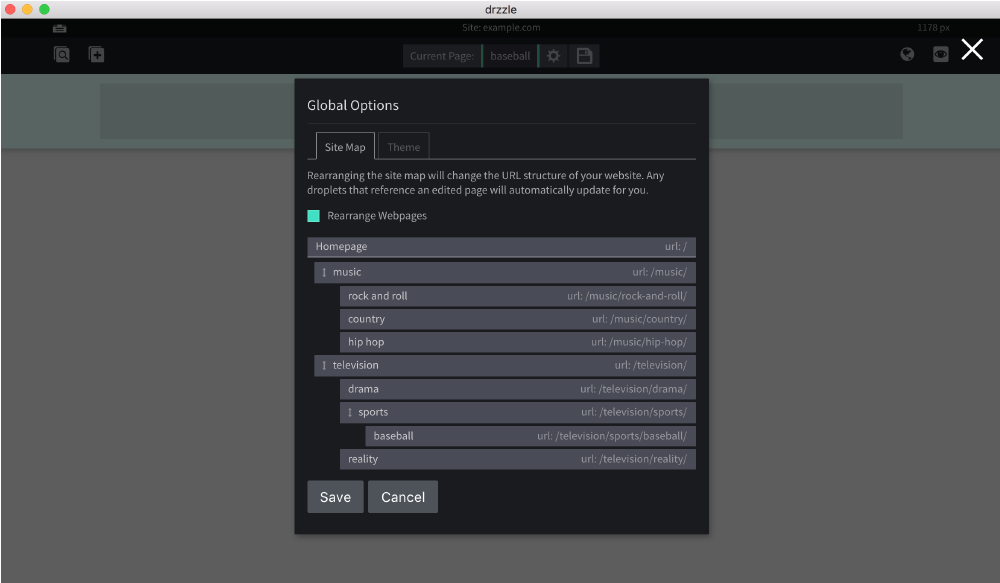
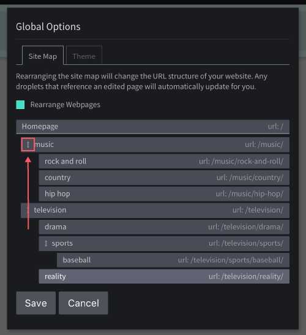

# Site Map

Our site map is a way for users to organize their website's directory structure and hierarchy. It's also a way to categorize content for search engines. Every page you create will be added to your site map.

## Overview

The site map for your website is located in the top control bar of the site editor. You can get to it by clicking the "Global Options" button. The site map should be in the first tab of that modal.

The image below is an example of how one would categorize their website for a make believe entertainment company. You'll notice that this map is broken down by music and television. From there you can nest pages that fall under those categories. Please keep in mind that the map only allows up to five levels deep of nesting at the moment.

## Organizing Pages
To edit the site map, you will need to check the "Rearrange Webpages". At which point you should be able to drag and drop pages around. See below example:

## Site Map URLS
An **important** thing to note is that when you update a page in your site map, you are also changing the public link of that page. You can see on each page in the map what the new url will look like as you're editing. If you have droplets that link to any pages that have their URL's updated, Drzzle will go and update those droplets for you.

## Page Children
When a page in the site map has nested pages (aka children), you'll notice that it will have a toggle icon to the left of it. This allows you to collapse and de-collapse it's children to save space as you're rearranging items. This becomes handy as more and more pages get added to the map and this modal gets longer.

Also keep in mind that if a page has children, you cannot delete the page from your site, you will need to move all of the children out first in the site map then you should be able to delete it.

